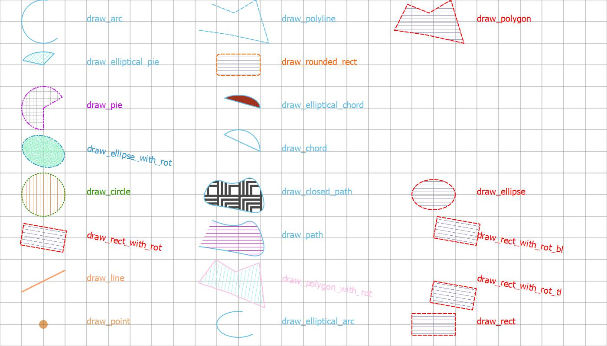
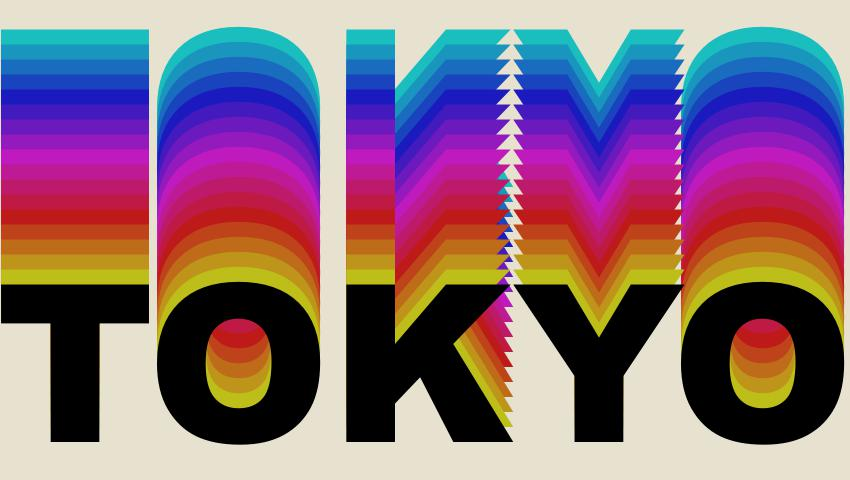
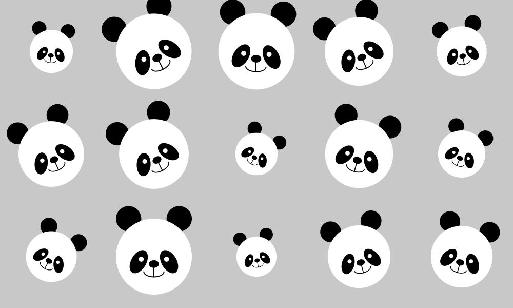

# About Super Simple Graphics
Procedural programming style graphics library based on PyQt5 for teaching python programming to designers.
So a lot of the functionalities are provided through global level functions for designers when they just want to create some visuals.
Please check out the example source code in the examples folder, and render results in the images folder.

## How to use the python library:
* Follow this wiki page
  - [https://github.com/corevfx/super_simple_graphics/wiki/Set-Up-Development-Environment](https://github.com/corevfx/super_simple_graphics/wiki/Set-Up-Development-Environment)

## Documentation
* Go to Wiki of this project for the documentation
  - [https://github.com/corevfx/super_simple_graphics/wiki](https://github.com/corevfx/super_simple_graphics/wiki)

## Hotkeys when the canvas is shown:
* Press s to save the image as file.
* Press d to toggle the display overlay layer. Once overlay layer is displayed, Left Mouse Button click on the canvas to show the coordinates of the clicked postion, and Right Mouse Button click to erase all overlay content.
* Press c to show the system color dialog where you can pick a color and see the r,g,b and h,s,v values that you can use in the python coding.
* Press f to show the system font dialog where you can see all the font names, styles and sizes that you can use in the python coding.

### Demo:
Use below code to run a demo to see most of the graphics functions.
```
# Import all the functions
import super_simple_graphics.canvas as sg
# Create the canvas first!
sg.create_canvas()
# Then call the drawing functions to create graphics
sg.demo()
# In the end, show the canvas!
sg.show_canvas()
```
The result of demo


## Examples:
### Create random circles

```
import math, random 
from super_simple_graphics.canvas import *

w=1000
h=600
number_of_points = 100
max_pen_width = 200

create_canvas(w,h)

for i in range(number_of_points):
    set_pen_width(random.random()*max_pen_width)
    set_pen_color(random.random()*255,0,0,random.random()*255)
    draw_point(i*(w/number_of_points), random.random()*h)
    
show_canvas()

```
### Create random lines

```
import math, random 
from super_simple_graphics.canvas import *

w = 1000
h = 600
number_of_lines = 100
max_pen_width = 30

create_canvas(w,h)

for i in range(number_of_lines):
    set_pen_width(random.random()*max_pen_width)
    set_pen_color(random.random()*255,0,0,random.random()*255)
    draw_line(i*(w/number_of_lines), h, i*(w/number_of_lines), random.random()*h)
    
    
show_canvas()

```
## For other examples, please look into the examples folder for source code.
[Click here for more examples](https://github.com/corevfx/super_simple_graphics/blob/master/examples/readme.md)

### Use for Generative Art
#### Circles 01


#### Circles 02


### Use for Graphics Design
#### Tokyo Bus


#### Kyoto Koinobori - day theme


#### Kyoto Koinobori - dark theme


#### Balloons


#### Sky Lantern


#### HSV Color Text


#### Mandala 


#### Draw Panda


#### Draw Panda Shaded


#### Color Gradient for Shading


#### Image Sampling


### Use for Data Visualization
#### Pie Chart


#### Bar Chart


## Tools:
### System Color Dialog


### System Font Dialog

